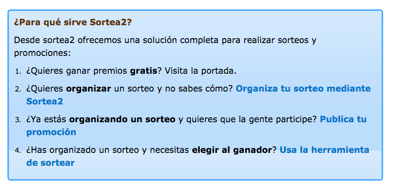
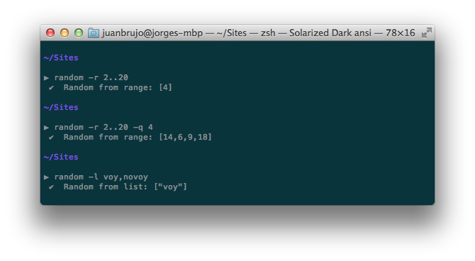

title: Lo resolví con JS
author:
  name: Jorge Epuñan
  twitter: beerjssantiago
  url: http://www.beerjs.cl
output: loresolviconjs.html
controls: true

--

# Lo resolví con JS

*BeerJS Santiago - diciembre 2015*

--

** Problema **

## elegir 4 ganadores de poleras BeerJS al azar

--

### Solución 1:


--

### Solución 2: [sortea2](https://www.sortea2.com)



--

### Solución 3: JavaScript

> [random CLI](https://github.com/juanbrujo/random-cli): NodeJS + CLI

❤ ❤ ❤ ❤ <br />
 ❤ CLI ❤ <br />
❤ ❤ ❤ ❤

--

```
// bin/random-cli.js

var program = require('commander');

program
  .option( '-r, --range <from>..<to>', 'A range', range )
  .option( '-l, --list <item1>,<item2>,<itemN>', 'A list comma separated', list )
  .option( '-p, --password <length>', 'Length', password )

console.log(' ✔  Random from range: %j', program.range);
console.log(' ✔  Random from list: %j', program.list);
console.log(' ✔  Random password: %j', program.password);
```

--

```
$ node bin/random-cli.js -l uno,dos,tres,cuatro
// ✔  Random from list: ["cuatro"]
```


